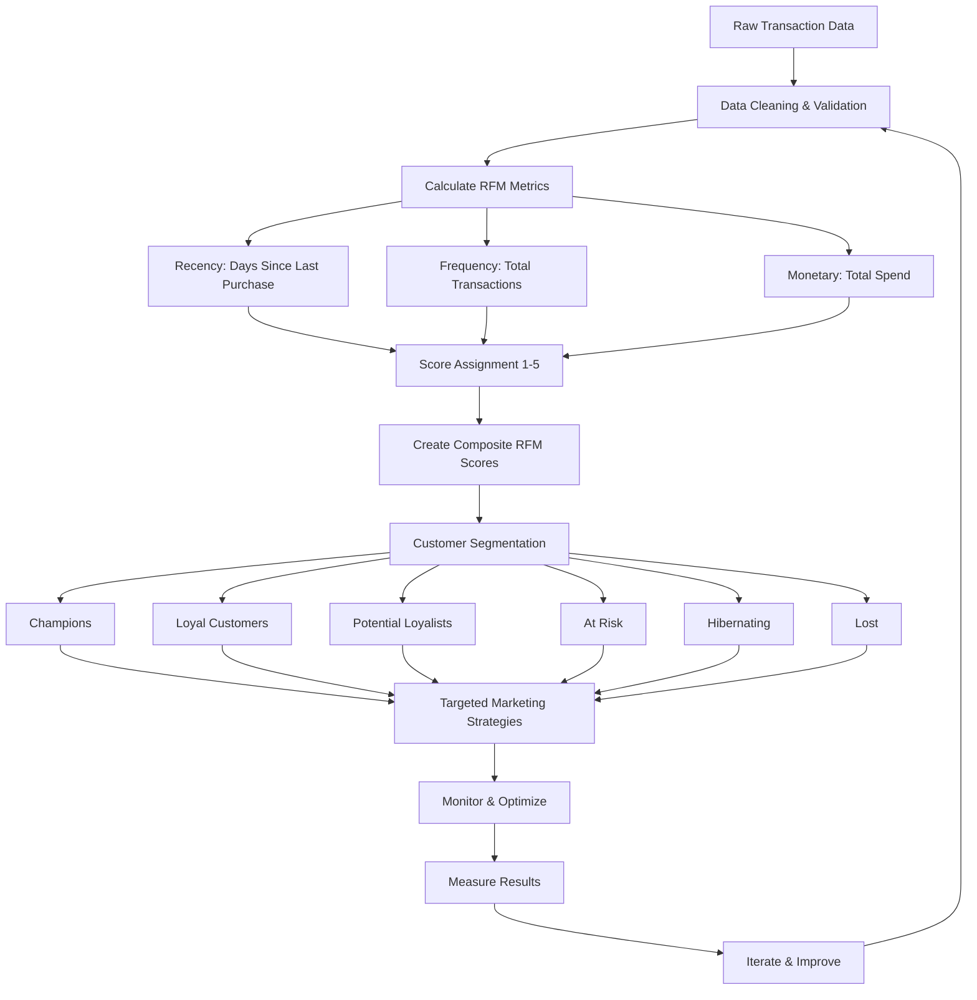

# RFM Analysis: Customer Segmentation for Business Growth

## 📊 Project Overview

RFM (Recency, Frequency, Monetary) Analysis is a powerful customer segmentation technique used to identify and prioritize customers based on their purchase behavior. This project implements a comprehensive RFM framework that helps businesses:

- **Segment customers** into meaningful groups based on transaction patterns
- **Identify high-value customers** who contribute most to revenue
- **Target marketing campaigns** with precision and personalization
- **Optimize resource allocation** by focusing on customers with highest potential
- **Predict customer churn** and implement retention strategies

## 💼 Business Impact

Implementing RFM Analysis delivers measurable business outcomes:

- **Increased ROI on Marketing**: Target the right customers with tailored messaging, reducing wasted spend by up to 40%
- **Higher Customer Retention**: Identify at-risk customers early and intervene with personalized retention campaigns
- **Revenue Growth**: Focus on high-value segments to maximize customer lifetime value (CLV)
- **Data-Driven Decision Making**: Replace gut feelings with quantitative insights backed by purchase history
- **Improved Customer Experience**: Deliver relevant offers and communications based on actual behavior patterns

### Key Metrics

- **Recency (R)**: Days since last purchase — lower is better
- **Frequency (F)**: Total number of purchases — higher is better  
- **Monetary (M)**: Total spend amount — higher is better

## 🔧 How It Works

### Step 1: Data Collection & Preparation
- Import customer transaction data including customer ID, purchase date, and transaction amount
- Clean and validate data to ensure accuracy
- Handle missing values and outliers appropriately

### Step 2: Calculate RFM Metrics
- **Recency**: Calculate days between analysis date and last purchase date for each customer
- **Frequency**: Count total number of transactions per customer
- **Monetary**: Sum total purchase value per customer

### Step 3: Score Assignment
- Divide customers into quintiles (1-5) for each metric
- Score 5 = Best, Score 1 = Needs Attention
- Create composite RFM scores (e.g., 555 = Champions, 111 = Lost Customers)

### Step 4: Customer Segmentation
Group customers into actionable segments:
- **Champions** (555, 554, 544): Best customers, buy often, spend most
- **Loyal Customers** (543, 444, 435): Regular buyers with good value
- **Potential Loyalists** (533, 532, 443): Recent customers with potential
- **At Risk** (244, 234, 143): Were good customers, haven't purchased recently
- **Hibernating** (142, 132, 122): Long time since purchase, low engagement
- **Lost** (111, 112, 121): Lowest scores across all metrics

### Step 5: Action & Strategy Development
- Design targeted marketing campaigns for each segment
- Implement personalized communication strategies
- Monitor segment migration over time
- Measure campaign effectiveness and iterate

## 🎯 Data Quality & Extensibility

### Data Requirements
- Minimum viable dataset: Customer ID, Transaction Date, Transaction Amount
- Recommended additions: Product details, customer demographics, channel information
- Data freshness: Update analysis monthly or quarterly for best results

### Extensibility Features
- **Scalable Architecture**: Handles datasets from thousands to millions of customers
- **Customizable Scoring**: Adjust quintile boundaries based on business needs
- **Integration Ready**: Compatible with CRM systems, marketing automation platforms
- **Advanced Analytics**: Extend with predictive modeling, cohort analysis, or machine learning
- **Visualization Support**: Generate charts, dashboards, and executive reports

## 📈 Visual Workflow (Mermaid Syntax)

The following diagram illustrates the end-to-end RFM analysis workflow:

---

## 📂 Previous Content

# RFM-Analysis-Customer-Segmentation-for-Business-Growth
RFM (Recency, Frequency, Monetary) Analysis is a powerful customer segmentation technique used to identify and prioritize customers based on their purchase behavior
